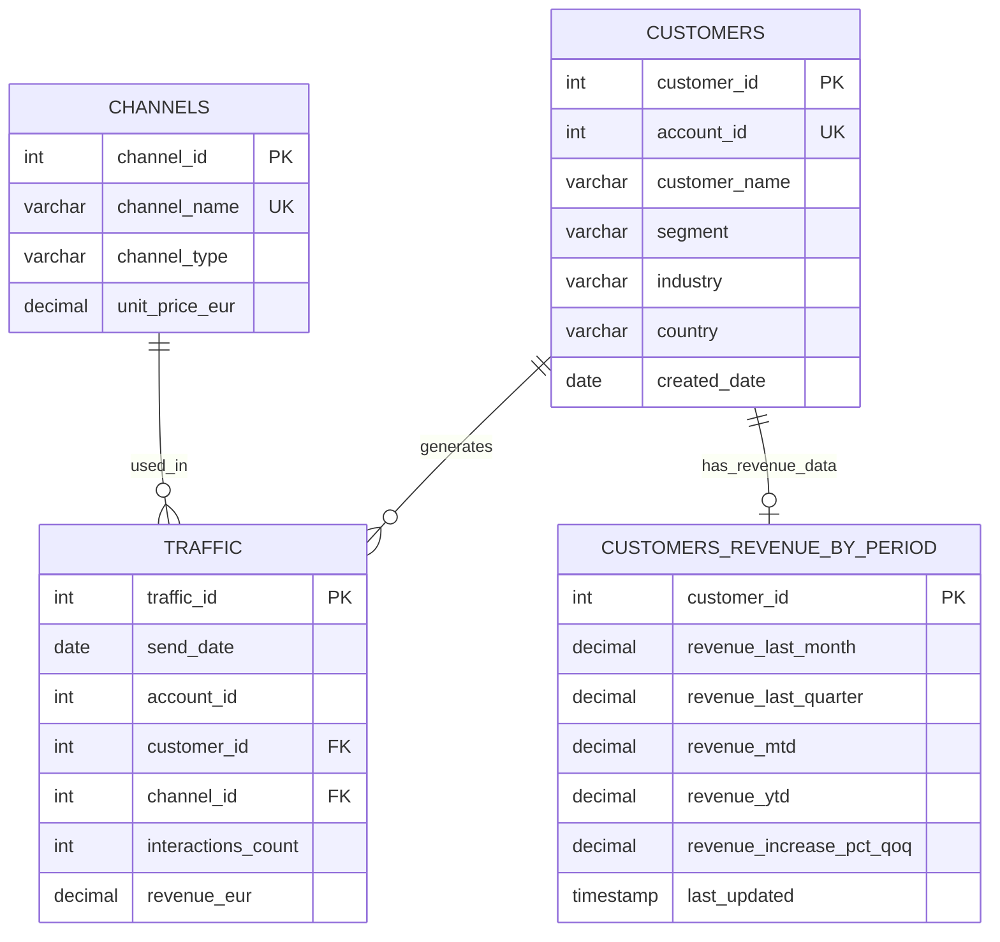

# Infobip Data Engineer Task

Data processing system that loads CSV data into PostgreSQL and runs analytics queries.

## Database Schema

### Entity Relationship Diagram



### Table Relationships

**CUSTOMERS ↔ TRAFFIC (One-to-Many)**
- One customer can have multiple traffic records
- Connected via `customer_id` (FK in traffic)
- Also connected via `account_id` for business logic

**CHANNELS ↔ TRAFFIC (One-to-Many)**
- One channel can be used in multiple traffic records
- Connected via `channel_id` (FK in traffic)

**CUSTOMERS ↔ CUSTOMERS_REVENUE_BY_PERIOD (One-to-One)**
- Each customer has one revenue summary record
- Connected via `customer_id` (PK in both tables)

### Unique Constraint Explanation

The `uk_traffic_unique` constraint on `(send_date, account_id, customer_id, channel_id)` prevents **duplicate traffic records** for the same:
- Date
- Customer 
- Channel

**Why this matters:**
- **Data Integrity**: Prevents accidental duplicate entries
- **Upsert Operations**: Allows safe "INSERT ... ON CONFLICT UPDATE" operations
- **ETL Pipeline**: When Glue job runs multiple times, it won't create duplicates
- **Business Logic**: One customer can't have multiple traffic records for the same channel on the same day

**Example scenario:**
Without this constraint, you could accidentally have:
```
send_date: 2024-01-15, account_id: 123, customer_id: 1, channel_id: 2, interactions: 100
send_date: 2024-01-15, account_id: 123, customer_id: 1, channel_id: 2, interactions: 50
```

With the constraint, only one record is allowed, and you can safely update it.

## Architecture

### Components
- **Base Infrastructure**: RDS PostgreSQL database, S3 buckets for data storage, VPC, IAM roles
- **ETL Pipeline**: Glue job loads CSV files from S3 into PostgreSQL tables
- **Analytics Pipeline**: Two Glue jobs - one for business queries, one for statistics
- **Orchestration**: Step Functions runs the pipeline, EventBridge schedules it monthly on 1st at 9 AM UTC

### Data Flow
1. **Data Generation** → CSV files (customers, traffic, channels) uploaded to S3
2. **ETL Pipeline** → Glue job loads data from S3 into PostgreSQL database
3. **Business Analytics** → Glue job runs 5 SQL queries and stores results
4. **Statistical Analysis** → Glue job calculates statistics and creates categories
5. **Scheduling** → EventBridge triggers the whole pipeline monthly on 1st at 9 AM UTC

## Deployment

### Prerequisites
- AWS CLI configured
- Terraform >= 1.0
- Python 3.8+

### Deployment Order
Deploy in this order due to dependencies:

#### 1. Data Generation
```bash
cd data_generation
python generate_dummy_data.py
```

#### 2. Base Infrastructure
```bash
cd infrastructure/base/terraform
cp terraform.tfvars.example terraform.tfvars
# Edit terraform.tfvars with your values
terraform init && terraform apply
```

#### 3. ETL Infrastructure
```bash
cd infrastructure/etl/terraform
cp terraform.tfvars.example terraform.tfvars
# Update with Base infrastructure outputs
terraform init && terraform apply
```

#### 4. Analytics Infrastructure
```bash
cd infrastructure/analytics/terraform
cp terraform.tfvars.example terraform.tfvars
# Update with Base infrastructure outputs
terraform init && terraform apply
```

#### 5. Orchestration
```bash
cd infrastructure/orchestration/terraform
cp terraform.tfvars.example terraform.tfvars
# Update with ETL and Analytics outputs
terraform init && terraform apply
```

### Configuration
Each infrastructure module includes a `terraform.tfvars.example` file. Copy to `terraform.tfvars` and update with your values.

## Analytics Features

### Business Queries (5 questions)
1. **Industry Exposure**: Which industry has the highest revenue?
2. **Segment Analysis**: What percentage of customers are in each segment?
3. **Recent Customers**: Which customers changed segments in the last 12 months?
4. **Top Customers**: Who are the top 20 customers by revenue?
5. **Monthly Active**: Which top 10% customers had revenue every month for 12 months?

### Statistical Analysis
- **Descriptive Statistics**: Min, Max, Mean, Median, Standard Deviation for numeric columns
- **Category Creation**: Low/Mid/High categories based on quartiles (Q1/Q3)
- **Extended Tables**: Industry exposure with revenue and customer count categories

### How it works
- **SQL Queries**: Simple, focused queries that answer specific questions
- **PySpark Processing**: Uses Spark for statistics and categorization
- **Database Storage**: Results stored in separate analytics tables
- **Monthly Updates**: Runs automatically on 1st of every month at 9 AM UTC

## Project Structure

```
├── analytics/                # Glue jobs and SQL queries
├── data_generation/          # CSV data generation scripts
├── database/                 # Database schema definitions
├── etl/                      # ETL pipeline components
├── final_additional_task/    # Additional Jupyter notebook task
│   ├── stock_comparison.ipynb # Jupyter notebook connecting to ALPHA_VANTAGE API
│   └── config.json            # Configuration for API keys and Azure storage
├── infrastructure/           # Terraform infrastructure code
│   ├── analytics/             # Analytics infrastructure
│   ├── base/                  # Base infrastructure (RDS, S3, VPC)
│   ├── etl/                   # ETL infrastructure
│   └── orchestration/         # Step Functions and scheduling
└── requirements.txt          # Python dependencies
```

## Branching Strategy

- `main`: Simulating production environment
- `develop`: Simulating development environment
